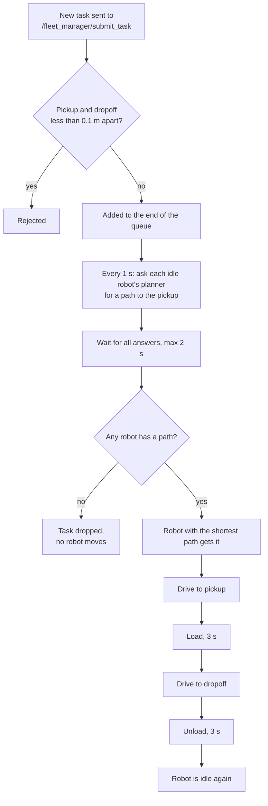
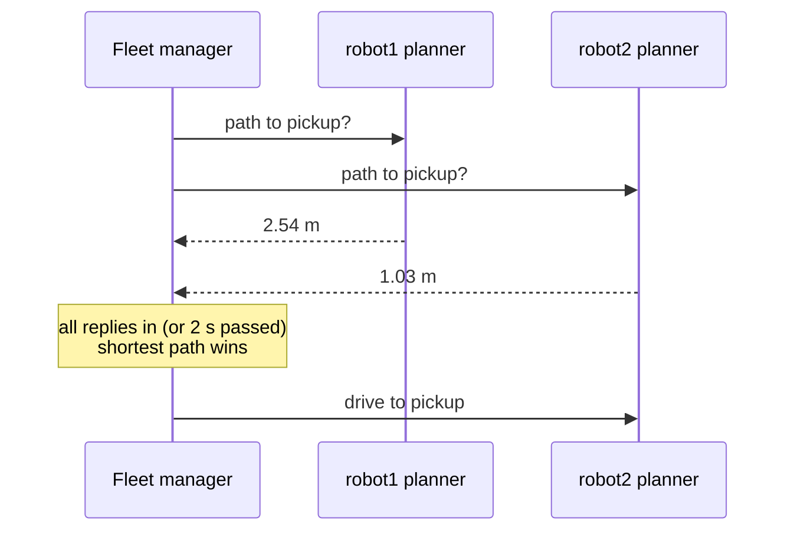
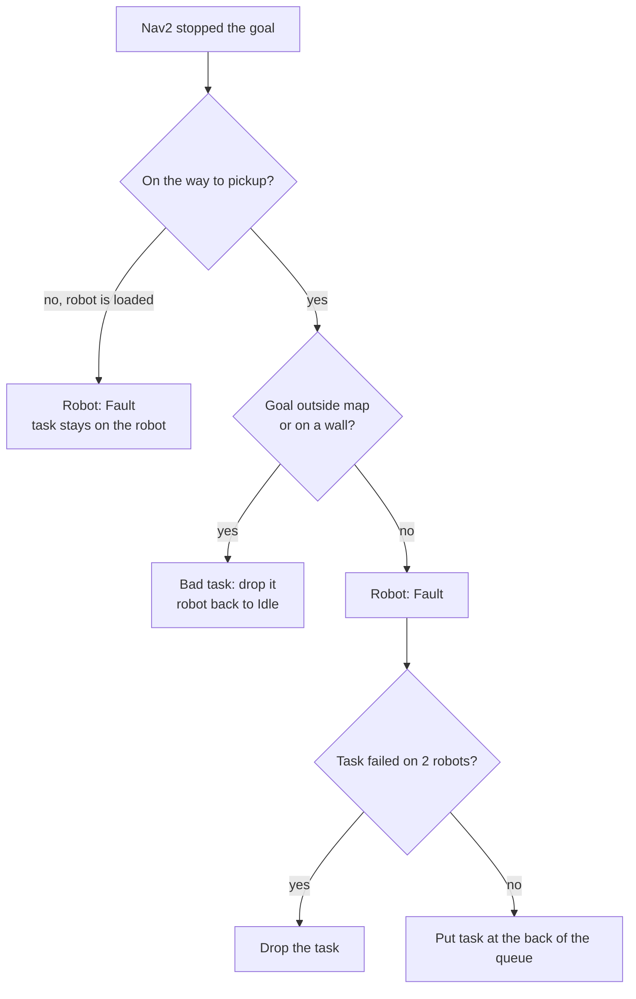

# Multi-Robot Transport System

A fleet of mobile robots coordinated by fleet manager that assigns the nearest available robot and hands out the task (pickup -> dropoff) in a TurtleBot3 sandbox world using Nav2 for localization and SLAM toolbox for building the map. This project is useful for somebody starting with ROS2 and C++ and this was also my primary reason for building it. This personal project is using ROS2 Lyrical, TurtleBot3 robot model, TurtleBot3 sandbox world and Gazebo Jetty. The fleet manager was written from scratch including the state machine, failure handling and unit tests for the core logic.

## Demo

Both robots working through the demo tasks in RViz:

https://github.com/user-attachments/assets/e1198b19-5692-46be-b80a-b52c5499b0cf

The same robots in Gazebo:

https://github.com/user-attachments/assets/eefe3640-3f74-4a78-9592-c8008ac0f085

## How it works

The path of one task:
1. Task comes in through /fleet_manager/submit_task (rejected if pickup is around dropoff)
2. FIFO queue with dispatch firing every 1 second
3. ask each Idle robot's planner (ComputePathToPose) for a path, wait for all replies (timeout after 2 seconds), pick the robot with the shortest path
4. NavigateToPose to pickup -> simulate loading (3 s) -> dropoff -> simulate unloading (3 s) -> Idle at dropoff

The list of robot states:
```
enum class RobotState
{
  Idle,
  Moving,
  Loading,
  Unloading,
  Fault
};
```



Fault and the other failure paths are in [Failure handling](#failure-handling).

Picking a robot for a task:



## What I built vs. what I used

| Mine | Used |
|---|---|
| `mrts_fleet_manager`: task queue, robot picking, state machine, failure handling | Nav2: AMCL, planner, controller |
| `fleet_core`: the logic as plain C++ without ROS, so it can be tested alone (13 gtests) | SLAM Toolbox, only to make the map |
| `mrts_interfaces`: the `SubmitTask` service | `nav2_minimal_tb3_sim`: robots and world |
| `mrts_bringup`: launch files, Nav2 params, the map | |

## Failure handling



If no robot's planner finds a path to the pickup, the task is dropped before any robot moves.

A failed task goes to the back of the queue, not the front. One failure can't tell if the robot or the task is the problem, and a bad task at the front would break the next robot right away.

The planner `tolerance` is set to 0.0. With the default 0.5, an unreachable pickup still gets a path that ends close to it, so the path length would be wrong and "arrived" would not mean "at the pickup".

## Running it

Tested on Ubuntu 26.04 with ROS 2 Lyrical.

```bash
git clone https://github.com/UrosKukovic/Multi_Robot_Transport_System.git
cd Multi_Robot_Transport_System
rosdep install --from-paths src --ignore-src -y
colcon build
```

Then in three terminals (run `source install/setup.bash` in each):

```bash
ros2 launch mrts_bringup sim_multi.launch.py
ros2 run mrts_fleet_manager fleet_manager_node
bash src/mrts_bringup/scripts/demo_tasks.sh
```

Or send one task yourself (coordinates are in the map frame):

```bash
ros2 service call /fleet_manager/submit_task mrts_interfaces/srv/SubmitTask \
  "{pickup_x: 2.0, pickup_y: 1.0, dropoff_x: 3.81, dropoff_y: -0.24}"
```

### Docker

Runs without RViz, so you follow it in the logs.

```bash
docker build -t mrts .
docker run -it --rm --name mrts mrts ros2 launch mrts_bringup sim_multi.launch.py use_rviz:=False
```

In a second terminal:

```bash
docker exec -it mrts /entrypoint.sh bash
ros2 run mrts_fleet_manager fleet_manager_node
```

`docker exec` skips the entrypoint, so it is called by hand to source the workspace.

Tests:

```bash
docker run --rm mrts bash -c "colcon test && colcon test-result --verbose"
```

## Limitations

- The robot list and start poses are hard-coded.
- A robot in Fault stays there, there is no recovery (human recovery in production)
- Only the path to the pickup is checked. An unreachable dropoff is found out with a loaded robot.
- No traffic control, hence no avoiding between robots
- No sensor fusion (EKF) yet, odometry comes straight from the simulator.
- No RViz in the Docker image.

## Layout

```
src/mrts_bringup         launch files, Nav2 params, map, demo script
src/mrts_fleet_manager   fleet_core (logic + tests) and the ROS node
src/mrts_interfaces      SubmitTask service
Dockerfile, docker/      container build and entrypoint
```
